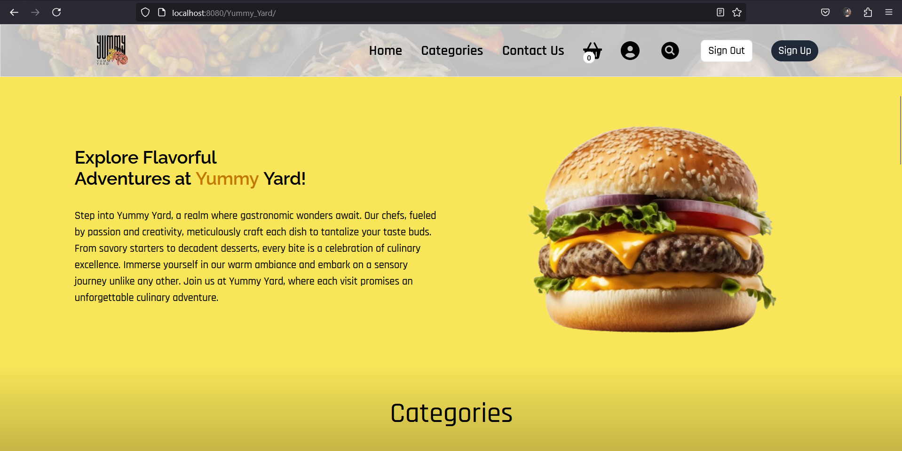
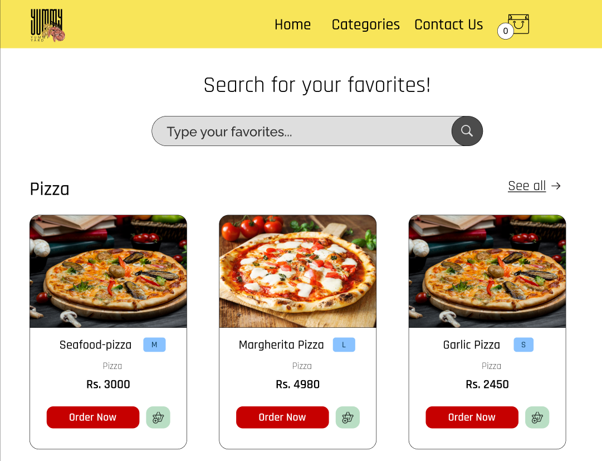
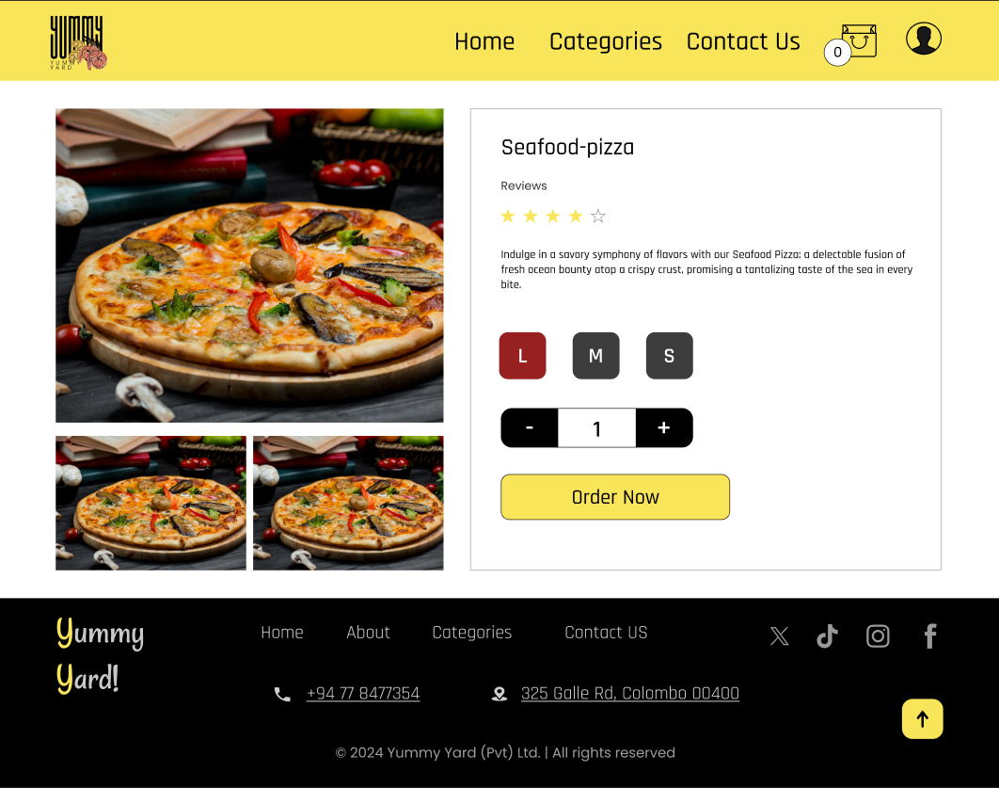
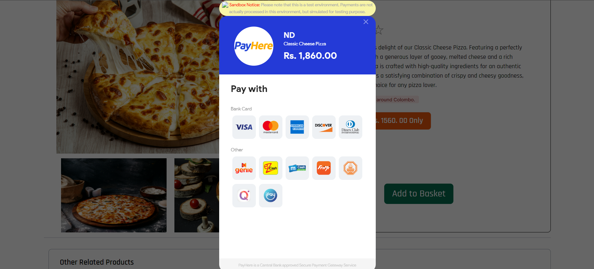
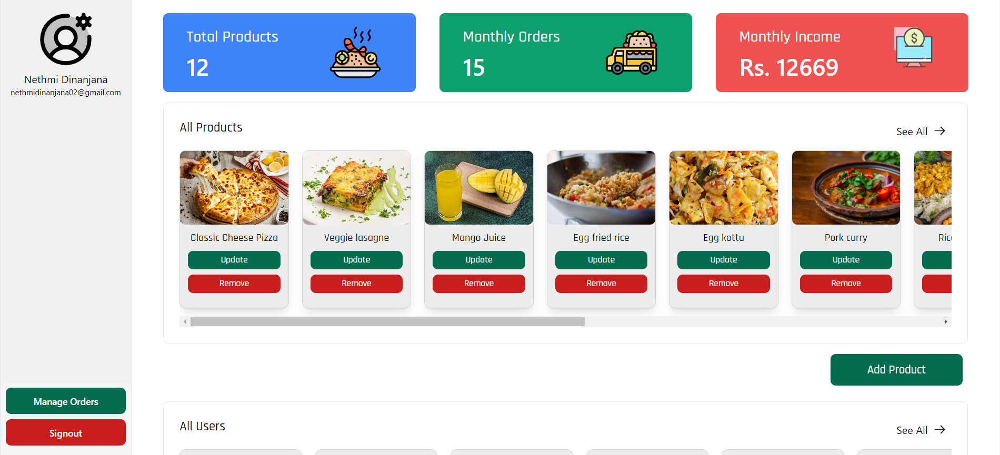

# 🍽️ Yummy Yard – A Food Selling Website

Yummy Yard is a dynamic e-commerce platform for online food ordering, built using **PHP, MySQL, HTML, CSS, and JavaScript**. It provides an interactive menu, user authentication, and seamless order management.

## 🚀 Features
- 🛒 **Interactive Menu** – Browse and select food items easily.
- 👤 **User Authentication** – Secure login and registration system.
- 📦 **Order Management** – Place, track, and manage food orders.
- 💳 **Payment Integration** – Add online payment support with PayHere.
- 📊 **Admin Dashboard** – Manage users, orders, and menu items.

## 🛠️ Tech Stack
- **Frontend:** HTML, CSS, JavaScript
- **Backend:** PHP, MySQL
- **Database:** MySQL

## 📸 Screenshots

  &nbsp;&nbsp;&nbsp;
  &nbsp;&nbsp;&nbsp;
  

  &nbsp;&nbsp;&nbsp;
  &nbsp;&nbsp;&nbsp;
  

  &nbsp;&nbsp;&nbsp;
  

